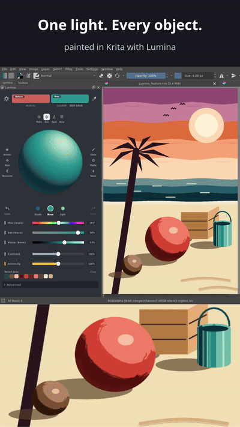

# Lumina

An interactive lighting study tool for Krita. A sphere is shaded from three
colours you control — **shadow**, **base** and **light** — so you can read how a
key light, an ambient bounce and an object's local colour interact, then sample
the resulting values straight into your brush.

The useful question it answers is never "what is the local colour" but "what
does this surface look like under this light" — which is why it earns its keep
on flat and cel-shaded illustration *and* on 3D shading and rendering. Pick the
cel-shaded bands, pick the smooth falloff; the three targets and the shading
controls work either way, and the sphere shows you which one you are actually
looking at.

<p align="center"></p>

Painted in Krita with its own brushes, every colour read off the Lumina sphere
zone by zone. Lumina stays docked beside the canvas the whole time.


That shot is the two worlds side by side. The beach is flat graphic work —
banded sky, hard-edged sun, silhouette palm and dog, birds, a fish shoal. The
panel beside it is a smoothly shaded 3D sphere lit from the same key. Three
colours sampled off the artwork — a sunset orange, a sea teal and a sand cream —
sit in *Recent picks*, and Lumina derived a coherent shadow / base / light set
from the orange; the sphere is what those values look like rendered rather than
banded. (The strip along the bottom of the canvas was painted from an earlier
version of these derivations.)


**New here? Start with [Getting started](documentation/GettingStarted.md).**

## Features

- **Calibrated shading** — fitted against a reference lighting app: shadows
  that stay rich and build into a core, a highlight that sits toward the light,
  reflected light on the far edge. Pure Python, no third-party dependencies.
- **Three linked targets** — *Shade*, *Base* and *Light*. Pick a base and the
  light and shadow are derived around it (in OKLCH); edit any of the three with
  perceptual Hue / Saturation / Value sliders, and undo / redo the changes.
- **The lemon sampler** — rests on the sphere under the pointer, shows the
  colour and hex under it, and sends a click straight to Krita's brush. Picks
  collect in **Recent picks** (pin the favourites).
- **Form zones** — the readout under the sphere names the zone under the
  pointer: Highlight, Light, Halftone, Terminator, Core shadow or Reflected
  light, so you can see where each band falls.
- **Four lamps** — Sun, Point (a nearby bulb), Spot (a soft-edged beam) and
  Area (a broad panel: soft edge, broad highlight); the zones follow the lamp.
- **Krita's colour, both ways** — an eyedropper pick or any colour you choose in
  Krita replaces the selected target, in the active layer's colour space
  (Display P3 layers included); Lumina's picks never come back as new targets.
- **Six lighting presets** — Artistic, Real, Nocturne, Gloss, Matte and Neon.
  Click one again to switch it off and get your lighting back; the lit preset is
  remembered across restarts.
- **Settings persistence** — your setup is saved as you work and restored next
  time Krita opens; light direction, highlight size, render quality, sticky
  distance and a compact mode live under the gear. After an update, values you
  never changed move to the new defaults; your own stay as you set them.
- **Responsive** — the full-quality sphere renders in the background, so
  sliders and animations never stall, and a colour change redraws about three
  times faster than before (bit-identical output).


## Installation

**From a release:** download the `Lumina-*.zip` file, then in Krita go to
**Tools → Scripts → Import Python Plugin from File** and select the zip —
import it directly, no need to extract anything. Then restart Krita.

**From source** (the plugin runs inside the Krita flatpak). From the repository root:

```bash
DEPLOY="$HOME/.var/app/org.kde.krita/data/krita/pykrita"
rsync -a --delete --exclude='__pycache__' --exclude='.pytest_cache' --exclude='lumina_log.txt' src/Lumina/ "$DEPLOY/Lumina/"
cp src/Lumina.desktop "$DEPLOY/"
```

Then restart Krita — it caches its plugin list at startup, so closing the window
is not enough. The dock appears under **Settings → Dockers → Lumina**.

See [documentation/KritaFlatpak.md](documentation/KritaFlatpak.md) for the full
deploy, cache-clear and verification steps, including a headless check that runs
the plugin under Krita's own Python.

## Usage

1. Open the **Lumina** docker.
2. Pick a target — *Shade*, *Base* or *Light* — by its colour dot or its name.
3. Adjust **Hue**, **Saturation** and **Value** for that target, or pick a colour
   in Krita (the eyedropper button, a colour selector) to replace it.
4. **Click and drag** on the sphere to sample a colour. Krita's foreground
   (brush) colour updates immediately; the sphere itself is never changed by
   picking. **Shift-click** instead makes the colour the selected target's.
5. Click a **preset** for a look, and again to switch it off.
6. Use the **gear** for light direction, highlight size, render quality, sticky
   distance and the compact panel.

## How it works

The sphere is a unit hemisphere. Each pixel maps to a surface normal, and the
shading is evaluated per pixel:

```
surface  = base, its hue moving toward the shadow's by signed N·L   # into the core
         + base -> light toward the lit peak
body     = surface × diffuse (soft floor, no hard terminator)
         + environment light × surface colour                       # sky, ground, ambient
         + reflected light on the edge away from the light
         + specular lobe centred toward the light
         + Fresnel rim at the silhouette
then contrast, saturation, mixer, glow and a soft display roll-off
```

The shading engine (`color_engine.py`) is deliberately free of Qt and Krita
imports, so the whole render can be unit-tested on any machine. See
[documentation/ARCHITECTURE.md](documentation/ARCHITECTURE.md) for the design
decisions and the reasoning behind each tuning constant.

## File structure

```
src/Lumina/
  __init__.py              Registers the dock widget factory with Krita
  sphere_docker.py         The docker: layout, controls, presets, persistence
  sphere_widget.py         The sphere: painting, picking, hover sampler
  color_engine.py          Pure-Python shading engine (no Qt, no Krita)
  color_processor.py       Adapter between the engine and Krita/Qt
  color_controls.py        Sliders, buttons, lemon sampler, recent picks, settings panel
  derivation.py            Light / shadow derivation and the OKLCH slider maths
  test_shading.py          Smoke tests (needs PyQt5, no Krita)
  test_shading_standalone.py  Engine tests, run from the repository root
```

## Dependencies

- **Krita 5.x.** Not Krita 6 — that is the Qt6 build and its Python API is
  PyQt6, so this PyQt5 plugin will not load there. Porting is the next step.
  Tested on the Krita flatpak, which bundles PyQt5 and Python 3.13.
- Nothing else. The shading is pure Python; there is no numpy.

## Authoring

Lumina was written with AI coding assistance, directed and reviewed by a human
who decided the design, the tuning constants, and every call about scope.
Disclosing that seems better than shipping code whose provenance people might
assume is different.

**The plugin itself contains no AI and makes no network calls.** It is a Phong
shading model implemented directly. Nothing is generated at runtime, nothing is
downloaded, nothing is sent anywhere.

Development ran through a local harness with [Guard](https://hol.org/guard) in
the loop. It gates actions before the assistant takes them — destructive shell
commands, secret access, software installs, data movement — by allowing,
asking, or blocking, and keeps a record of what happened. It guards the
machine, not the source: nothing it protects lives in this repository, and the
plugin ships with none of it.

One constraint shaped the whole codebase: **keep the import surface as small as
possible.**

`color_engine.py`, which does all the actual shading, imports only the standard
library: `math`, `time`, `logging` and `typing`. The rest
of the plugin adds only PyQt5, which Krita already ships, and Krita's own
scripting module (modules of the plugin itself in *italics*):

| Module | Imports |
|---|---|
| `color_engine.py` | `math`, `time`, `logging`, `typing` |
| `derivation.py` | `math` |
| `color_processor.py` | `PyQt5`, `collections`, `copy`, `importlib`, `os`, `time`, `typing`, *`color_engine`* |
| `color_controls.py` | `PyQt5`, `math`, `random`, `time`, `typing`, *`derivation`*, *`tooltip`*, *`typed_entry`* |
| `sphere_widget.py` | `PyQt5`, `math`, `typing`, *`lumina_logging`* |
| `sphere_docker.py` | `PyQt5`, `krita`, `concurrent.futures`, `json`, `math`, `os`, `sys`, `threading`, `time`, `typing`, `weakref`, *the modules above* |

Every one of those is either the Python standard library or shipped with Krita.
There is no numpy, no colour-science library, no third-party package of any
kind, and nothing to install.

That was not asceticism. It means:

- the plugin cannot break because a dependency shipped a breaking change
- the whole render can be unit-tested with a bare Python install
- there is no supply-chain surface beyond Krita itself

If you want to check that for yourself, the whole import surface is one command:

```bash
grep -rhE '^\s*(import|from)\s' src/Lumina/*.py | sort -u
```

If you contribute, please keep it that way. It is the plugin's main practical
advantage over anything built on a shading or colour library.

## Contributing

Contributions are genuinely welcome — bug reports, fixes, presets, translations,
and especially **real artists telling us what is awkward to use**, which is the
feedback that has changed this plugin the most.

Everyone taking part is expected to follow the
[Code of Conduct](CODE_OF_CONDUCT.md).

A few things that will make a patch easy to merge:

1. **Open an issue first** for anything larger than a fix, so we can agree on
   the approach before you spend an evening on it.
2. **Keep the engine pure.** Changes to `color_engine.py` must not import Qt,
   Krita, or anything outside the standard library. It is the one file the test
   suite can run anywhere, and that is worth protecting.
3. **Run the tests** before opening a pull request:

   ```bash
   python3 src/Lumina/test_shading_standalone.py   # from the repo root
   ```

4. **Match the surrounding style** — 4-space indent, docstrings on anything
   non-obvious, and comments that explain *why* rather than restate the code.
   There is a fair amount of that in here, and it is deliberate.

If you are new to the codebase, [documentation/ARCHITECTURE.md](documentation/ARCHITECTURE.md)
explains the module layout and where each decision came from.
[documentation/Bugs.md](documentation/Bugs.md) records what has already gone
wrong and how it was fixed, which is probably the fastest way to learn the
traps.

## Support

Lumina is free and MIT licensed, and it will stay that way. If it earns its
keep for you and you'd like to say so:

**[:heart: Sponsor on GitHub](https://github.com/sponsors/Vyeche)**

Sponsorship goes toward keeping it working against new Krita releases, and
toward the time that goes into bug reports and feature work from people who
aren't writing code. It is genuinely optional, and the plugin does not gate
anything behind it.

If you would rather not sponsor, a star, an issue with a real bug report, or
telling a colleague about it helps just as much. Those are the things that
actually change the software.

## Running the tests

```bash
python3 src/Lumina/test_shading_standalone.py   # from the repo root
python3 src/Lumina/test_shading.py              # needs PyQt5
```

`test_shading_standalone.py` hardcodes repo-relative paths, so it must be run
from the repository root — from inside `src/Lumina/` it fails with a
`FileNotFoundError` on a doubled path.

## Documentation

| File | Description |
|------|-------------|
| [documentation/GettingStarted.md](documentation/GettingStarted.md) | Install, enable, and a walkthrough with screenshots |
| [documentation/ARCHITECTURE.md](documentation/ARCHITECTURE.md) | Module layout, data flow, design decisions |
| [documentation/KritaFlatpak.md](documentation/KritaFlatpak.md) | Deployment — the single source of truth |
| [documentation/TestingGuide.md](documentation/TestingGuide.md) | The test suites and how to run them |
| [documentation/Bugs.md](documentation/Bugs.md) | Bugs hit, with the real crash logs and the fixes |
| [documentation/CommonIssues.md](documentation/CommonIssues.md) | Wider troubleshooting |
| [src/Lumina/MANUAL.md](src/Lumina/MANUAL.md) | The user-facing manual Krita shows under Help → Plugin Help |
