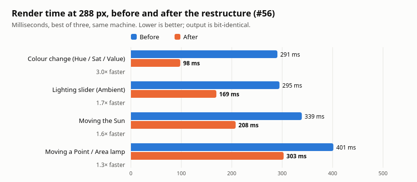

# Lumina Plugin — v2 (Lumina) Architecture

## Overview

Lumina is a Krita Python plugin providing an interactive 3D color sphere
for intuitive color picking. It renders a shaded sphere using Phong shading with
configurable ambient, diffuse, and specular lighting. Users pick colors by
dragging across the sphere surface, which updates Krita's foreground color in
real-time.

**Version 2 ("Lumina")** reworks the UI into a compact, icon-driven,
color-coded vertical sidebar (Blender/Substance Painter aesthetic), replacing
the previous wide, text-labeled panel.

---

## Architecture & Data Flow

### High-Level Structure

```
Lumina (Plugin)
├── SphereDocker (DockWidget) → Main UI container (V2 icon-driven sidebar)
│   ├── SphereWidget (QWidget) → Renders the small circular sphere preview
│   │   └── PaintEvent → Draws QImage onto widget; mouse picking
│   ├── Controls (ColorSlider, ToolButton) → User input
│   └── SphereColorProcessor → Shading engine adapter
└── Lumina.desktop → Plugin manifest
```

### Data Flow

1. **User Action** → Slider/BTN update → `set_light_intensity()`, etc.
2. **Engine Update** → `SphereColorProcessor` delegates to pure `ColorEngine`
3. **Image Generation** → `render_image()` → QImage with shading
4. **Render** → `SphereWidget.paintEvent()` → displays image
5. **Pick Color** → Mouse drag → `pixelColor()` → set Krita foreground

### Key Modules

| Module | Purpose | Location | Qt-Dependent? |
|--------|---------|----------|---------------|
| `SphereDocker` | Main docker widget (V2 UI) | `sphere_docker.py` | Yes (Krita only) |
| `SphereWidget` | Sphere rendering + picking | `sphere_widget.py` | Yes (Krita only) |
| `ColorEngine` | Pure-Python Phong shading | `color_engine.py` | **No** — testable anywhere |
| `SphereColorProcessor` | Krita-facing adapter | `color_processor.py` | Partial (guarded Qt import) |
| `ColorControls` | Icon-driven, color-coded widgets; `ColorSampler` (lemon), `RecentColors`, `SparkleBurst`, `SettingsPanel` | `color_controls.py` | Yes (Krita only) |
| factory | Plugin registration | `__init__.py` | No |

---

## Design Decisions (v2)

### Why split the shading engine from Qt?

PyQt5 is **only available inside the Krita flatpak at runtime** — not on the
host machine or in CI. By making `color_engine.py` pure Python (tuples, no Qt),
the shading math can be unit-tested anywhere:

```bash
python3 test_shading_standalone.py   # runs on host, CI, or in Krita
```

### Why icon-driven, color-coded UI?

The V2 design shows a professional, compact sidebar. Key changes from v1:

| v1 (old) | v2 (new) |
|----------|----------|
| Wide text-labeled panel | Narrow vertical sidebar |
| Plain QSliders with labels | Color-coded thin sliders (RGB-style accent tints) |
| 200px square-ish sphere | Small circular sphere (120px) |
| Text buttons | Icon-driven toggles with accent dots |

### Accent color palette

Each control family has a distinct accent color so you can read channel values
at a glance without labels:

```python
Accent.RED     = (231, 72, 80)    # base / diffuse
Accent.GREEN   = (77, 210, 129)   # green channel
Accent.BLUE    = (74, 153, 246)   # blue channel
Accent.AMBER   = (251, 188, 54)   # intensity / highlight
Accent.PURPLE  = (167, 139, 250)  # ambient / environment
Accent.CYAN    = (34, 211, 238)   # glow / specular
Accent.NEUTRAL = (160, 174, 193)  # generic
```

---

## File Layout

| Path | Purpose |
|------|---------|
| `color_engine.py` | Pure-Python shading engine (no Qt) |
| `color_processor.py` | Krita-facing adapter over `ColorEngine` |
| `color_controls.py` | Icon-driven, color-coded control widgets |
| `sphere_widget.py` | Interactive sphere surface with picking |
| `sphere_docker.py` | Main V2 docker widget |
| `__init__.py` | Factory registration entry point |
| `Lumina.desktop` | Plugin manifest |
| `test_shading_standalone.py` | Shading engine tests (no Qt) |

---

## Development Commands

### Test (host / CI — no Krita needed)

`test_shading_standalone.py` hardcodes repo-relative paths, so it must be run
**from the repository root** — not from inside `src/Lumina/`, where it
fails with `FileNotFoundError` on the doubled path.

```bash
python3 src/Lumina/test_shading_standalone.py
```

### Install into Krita (flatpak)

See **[KritaFlatpak.md](KritaFlatpak.md)** for the deploy, cache-clear, restart
and verification commands. That document is the single source of truth for
deployment; it is not duplicated here.

---

## Shading Model

`color_engine.py` implements an extended Phong model, in this order per pixel:

1. Tonal path shadow → base → light by N·L (`TONAL_SHADOW_START`, `TONAL_BASE`,
   `TONAL_LIGHT_POWER`), times the diffuse response (`DIFFUSE_FLOOR`)
2. Shadow-colour blend, weight `(1 - N·L)^SHADOW_FALLOFF`
3. Fresnel rim at the silhouette (`RIM_POWER`, `RIM_LIGHT`)
4. Ambient fill
5. Brightness / saturation
6. **Specular highlight** — the subject of the next section
7. Mixer mode, contrast, glow
8. Display roll-off: identity up to `TONE_SHOULDER`, exponential ease above

Tuning constants live at the top of the module with the reasoning for each value
in comments, so the render can be adjusted without reading the loop.

### The specular highlight is a soft shoulder, not a clamp

The highlight is a Phong lobe `((N·R)·L)^(2·shininess)`, but its ceiling is
applied as a **rational curve**, not a clamp:

```python
spec = SPEC_MAX * s * (SPEC_KNEE + 1.0) / (s + SPEC_KNEE)   # color_engine.py
```

**Why.** Clamping at `SPEC_MAX` pinned every pixel above the ceiling to exactly
the ceiling, producing a flat-topped plateau ~4,400 px across at the default
shininess, with a visible step at its edge. The highlight read as a grey disc
*laid on* the sphere rather than as a sheen. The curve above passes through the
same origin and the same peak (`s=1 → SPEC_MAX`) but never saturates, so there
is no plateau and no discontinuity in the gradient — and it redistributes the
plateau's energy outward, widening the sheen without making it brighter.

Measured on the 256 px render (`shininess` 1.6 / 2.0 / 5.0):

| Metric | Before | After |
|---|---|---|
| Flat core (px) | 4356 / 3567 / 1499 | 264 / 212 / 85 |
| Area ≥50% of peak | 15.2% / 12.7% / 5.6% | 16.9% / 14.2% / 6.3% |
| Max per-pixel step | 0.0265 / 0.0278 / 0.0376 | 0.0199 / 0.0190 / 0.0211 |
| Peak | 0.5000 | 0.5000 (unchanged) |

`SPEC_KNEE = 0.35` was chosen by sweeping knee strength. Lower values spread the
sheen further but steepen the core, reintroducing a hotspot.

**Tuning.** The knee is exposed as `ColorEngine.spec_knee` and driven by the
**Diffuse** slider, which maps 0–100 onto `SPEC_KNEE_MAX`–`SPEC_KNEE_MIN`
(inverted, since a low knee is the diffuse look). It sits next to **Specular**
in the Advanced section because the two are halves of one control: Specular sets
the highlight's *width*, Diffuse its *softness*. The curve is monotonic over
`[0, 1]`, so it cannot ring or invert at any `shininess`.

### Calibrated against a reference lighting app

The derivation (`derivation.py`) and the tonal path and roll-off above were
fitted to a reference app's own spheres, captured in the Ref Tester document
(`images/`, not committed). `tools/reference_calibration.py` holds the
derivation data, fit and leave-one-out check. Each sphere was compared with its
own shadow/base/light and a matched light (304°/41°, since adopted as the
default).

Mean error (OKLab ×100) before → after the engine change: highlight 11.0 → 6.3,
lit 12.3 → 6.8, terminator 7.4 → 5.7, core shadow 6.7 → 4.4, rim 8.3 → 4.9,
sky side 10.9 → 6.0, ground side 6.6 → 4.5. Two things drove it: Reinhard
compressed every value (a lit `#ff0000` came out `#bb0000`), and the light
colour washed over the whole lit half instead of gathering in the highlight.
Slider defaults were not changed.

A second pass fixed what a side-by-side in Krita showed was still wrong: the
reference uses the three targets as *ingredients*, not paint. Its unlit side is
a base/shadow mix (`TONAL_SHADOW_MIX` 0.53) darkened by the shading, its
highlight only reaches `TONAL_LIGHT_MAX` (0.83) of the light target, and its
specular is warm on saturated colours but neutral on greys (`SPEC_WARMTH`,
scaled by the base's saturation; a preset's highlight colour is left alone).
Region error after the second pass: highlight 4.7, lit 5.8, terminator 3.9,
core shadow 2.8, rim 3.9, sky side 5.5, ground side 2.7 (overall 9.4 → 4.4).
These figures are in-sample, fitted and scored on the same screenshots.

A third pass (issue #45) went after depth: the shadow side read paler and
greyer than the reference, and dark colours had almost no highlight. Measured
along N·L on every reference sphere, lightness already matched; chroma and the
highlight did not.

- **Environment light takes the surface's colour** (`ENV_ALBEDO` 0.7). The
  sky-tinted ambient and the sky / ground bounce were added as plain light, a
  grey film that dominated dark saturated shadows: the reference's blue keeps
  chroma in step with lightness (C/L 0.68 at the core, base 0.69), Lumina's
  fell to 0.49.
- **Shadow hue by signed N·L** (`SHADOW_HUE_MAX` 0.59 from `SHADOW_HUE_START`
  0.57 to `SHADOW_HUE_CORE` −0.26). The surface keeps the base's lightness and
  moves its OKLab chroma direction toward the shadow target's, building from
  the lit side of the terminator into the core; the lighting does the
  darkening. It replaces the linear `TONAL_SHADOW_MIX` blend, which put the
  shadow colour's hue at the terminator and stopped at N·L 0.
- **The highlight sits near the light** (`SPEC_TOWARD_LIGHT` 0.875). The
  reference's peaks about two thirds of the way toward the light and stays
  bright to the lit silhouette; a Blinn lobe sat nearer the centre and died
  before the edge. With the lobe moved, it is broader and stronger (shininess
  8.9, `spec_max` 0.61; the presets' `spec_max` scaled by the same 61/27), and
  the light colour's share of the highlight drops (`TONAL_LIGHT_MAX` 0.4).
  `SPEC_WARMTH` 0.75.

Whole-sphere error (OKLab ×100 per N·L band and limb sector, 15 reference
spheres): 3.16 → 1.86. The lit limb on dark colours went from 17–23 to 1–5,
the highlight band on black from 9.4 to 3.8.

A fourth pass (issue #45, round 2) went after the *structure* of the shadow
side, which ring averages hide: base, shade, core and rim sit next to each
other, and the gradation between them is what reads as depth. It was scored
in cells of signed N·L × radius, in a wedge facing away from the light, and on
the shape of lightness against N·L.

- **The shade grades longer.** The diffuse response is now
  `DIFFUSE_LEVEL · (1 + g)E / (1 + gE)`: `DIFFUSE_GAIN` (g, 0.275) sets how
  soon it bends over and `DIFFUSE_LEVEL` (1.32) how high it goes. It was
  2gE/(1+gE) with g 1.155, which tied the two together; the shade was nearly
  at full brightness by N·L 0.3 and squeezed into a narrow band. The
  reference brightens almost linearly from the terminator to N·L 0.6.
- **The rim is a band.** Reflected light used `edge ** REFLECT_POWER`, nearly
  all of it in the outermost few percent. It now rises as a smoothstep from
  `REFLECT_START` 0.38 to `REFLECT_END` 0.82 (in 1 − N.z) and holds, at
  `REFLECT_STRENGTH` 0.065, so it lifts out of the core and levels off at the
  silhouette. `REFLECT_POWER` applies only when `REFLECT_END` is 0.
- Refitted with them: `FLOOR_SOFTNESS` 0.193, `REFLECT_SPREAD` 3.88,
  `SHADOW_HUE_MAX` 0.575, `SHADOW_HUE_CORE` −0.32. Matte's intensity went
  from 96 to 80 to keep its peak where it was (the higher curve top lifts a
  surface with no specular).

Whole-sphere error 1.86 → 1.65; shadow-structure error 1.74 → 1.54; mean
lightness-curve error from the terminator to N·L 0.6, 0.031 → 0.015.
`test_shade_grades_into_the_shadow_and_the_rim_is_a_band` holds both.

Then the highlight. Lumina's peak was 0.02–0.10 OKLab L brighter than the
reference's on every sphere (0.06 on average) and sat further out, about 0.74
of the radius toward the light against the reference's 0.66. Fitted on the
high-N·L bands and the peak's brightness and position, with the whole-sphere
error held where it was:

- `SPEC_GAIN` 0.748, a new engine-side scale on the specular sheen under the
  Highlight strength slider, so nobody's saved `spec_max` moves.
- `SPEC_TOWARD_LIGHT` 0.875 → 0.845, which brings the peak in.
- `TONAL_LIGHT_MAX` 0.4 → 0.16 and `TONAL_LIGHT_POWER` 8 → 2.39: less of the
  light colour, spread over the lit side instead of packed at the peak.
- `TONE_SHOULDER` 0.646 → 0.556, `SPEC_WARMTH` 0.75 → 0.51, and
  `DIFFUSE_GAIN` 0.275 → 0.329.

Highlight-band error 3.36 → 2.24; peak brightness-and-position error
6.79 → 1.79; whole-sphere 1.65 → 1.66; shadow structure 1.54 → 1.55. Peaks
now: black 0.784 (reference 0.76), blue 0.778 (0.76), green 0.912 (0.92).
`test_highlight_peak_matches_the_reference_brightness` holds them.

### Render pipeline (issue #56)



`render()` and `render_bgra()` (used by the processor) run a restructured pipeline. `render_reference()` is the original, kept unchanged:
- it's the reference the fast path is held to (`test_fast_pipeline_is_bit_identical_to_the_reference`, at an even and an odd size);
- engines that override the material stage or `render()` (the diagnostics) fall back to it.

What changed, all bit-identical (every expression keeps the reference's order):

- **Flat data, sphere pixels only.** The pipeline uses flat per-channel lists instead of rows of tuples, and loops only over the sphere's row spans (one run per row).
- **Per-size tables, built once** (`_fast_geometry`): spans, the alpha bytes, each antialiased edge pixel's nearest interior pixel (the packer used to search for it on every render), and the blur normalisers.
- **Light-dependent terms cached with the light** (`_fast_lighting`). Per pixel: the tonal weights, the shadow-hue index, the diffuse body factor, the ambient and reflected-light factors, the sky and ground weights, the clamped specular term and the mixer term. A colour change (Hue / Sat / Value, the commonest edit) reruns only the colour-and-display loop. Exact zeros are skipped: no specular where N·L is 0 or below the knee, and no reflected light on the lit side.
- **Rim and glow weights** are cached per light and their settings (`_fast_accents`).
- **Blur:** the masked separable blur uses whole-image shifted slices with the normaliser folded in (`_blur_flat`). That is exact when no sphere pixel touches the border (every even size). Otherwise it runs per row with edge replication (`_blur_pass`).
- **sRGB:** encoded through a table already rounded to 8 bits, and written into the BGRA buffer by slice assignment.
- **Sun's light stage** skips the per-pixel lamp calls (direction, illuminance and half vector are constant). The other lamps' normalisation is inlined.

Each change in the chart above (measured by `tools/render_perf_chart.py`) runs on top of a cache that is already warm. A colour change at 288 px went from ~290 ms to ~100 ms; changes to lighting and the light run 1.3–1.7× faster. They are still bound by the per-pixel lighting pass and, for Point / Spot / Area, the per-pixel lamp evaluation. Those are the next places to look.

### Lamp models (issue #53)

All four go through the same light stage: per pixel, `_light_for_surface`
gives a light direction and an illuminance, from which N·L, the half vector
and the signed N·L for the shadow hue follow, so the fitted shading applies to
every lamp. Only **Sun** was fitted against the reference spheres.

- **Sun** — parallel light, illuminance 1, so the terminator is at 90°.
- **Point** — a bulb at `LIGHT_DISTANCE` (3 radii), inverse square, with the
  reference flux giving 1.0 at the sphere's centre. Its near side is about
  2.1× brighter, and it lights a smaller cap: the terminator is at
  acos(1/3) ≈ 70.5° from the light.
- **Spot** — Point's light inside a 35° cone (`SPOT_OUTER_DEG`) aimed at the
  centre, fading over its outer quarter (`SPOT_BLEND`): a lit pool with a
  soft rim.
- **Area** — a square panel `AREA_SIZE` (2 radii) across, facing the sphere.
  It has Point's brightness times the panel's own cosine. As a disc of equal
  area it spans an angular radius *a*, so over `|cos| < sin a` the cosine is
  replaced by `(cos + sin a)² / (4 sin a)`, the standard horizon
  approximation for a disc light. The light direction is bent toward the
  normal to carry it, so the penumbra reaches the tonal path, the shadow hue
  and the specular. It used to be about 18× too bright (the power was never
  divided by 4π), which blew the lit side out to a hard edge, and
  `AREA_SIZE` had no effect. Its highlight is a patch, not a point: the lobe
  (knee included) is stretched in angle by f = √(1 + a²·n/2), where n is
  the shininess, and its peak is divided by f² (`_area_spec_spread`), so the
  same light spreads wider and dimmer.

### Form zones on hover

`ColorEngine.form_zone(u, v)` names the painter's zone at a sphere point: Highlight, Light, Halftone, Terminator, Core shadow or Reflected light. It uses the same light terms that shade the pixel:
- the lamp's per-pixel direction and illuminance, so a Spot's beam and an Area's soft edge count;
- the specular lobe, including Area's spread;
- the reflected band's shape and direction.

The hover readout appends it after H / S / V, so moving over the sphere shows where each band falls under the current lamp. Thresholds are the `ZONE_*` constants.

### Talking to Krita's widget tree

Never search Krita's whole main window from Python (`findChildren` on `qwindow()`). PyQt wraps every object it visits, and the objects inside Krita's QML panels print `QObject::connect: No such signal QQuickPalette::destroyed(QObject *)` (and three more) as they are wrapped. Lumina did this on every colour pick until #61.
- The canvas pick watch searches the central area only.
- The active-tool lookup searches only the Toolbox dock, taken from `Krita.instance().dockers()`.

## Persistence

User settings are stored with `QSettings` in `IniFormat` under the flatpak's
config dir — a plain-text file, readable and editable without Krita running.

Persisted: the three target colors, light azimuth/elevation, render quality,
sampler visibility, and every slider (contrast, intensity, ambient, specular,
diffuse, glow, tone, base level, mixer mode). Deliberately *not* persisted: the
last-picked brush colour and the active target, both per-session choices.

Two design points worth keeping:

- **Autosave is a single choke point**, in `_rebuild_sphere`, not per-handler. Every
  control already routes through it, so a control added later cannot be silently
  left unsaved — which is exactly what happened during development when each
  handler saved individually.
- **Restoring is guarded by `_syncing`**, held across the whole of
  `_load_settings` including the widget updates. The settings popup reports its
  *entire* state on every emission, so restoring its widgets one at a time pushes
  a half-applied mix of restored and still-default values back into the engine;
  `SettingsPanel.sync_from` blocks signals for the same reason.

**Schema versions.** `SETTINGS_VERSION` is written with every save and read
first on load; each bump migrates older files once. v6 (issue #57) handles
defaults that changed without a bump: 2.7.0 recalibrated the lighting while
settings stayed at v5. `migrate_settings_defaults` moves a value only if it
still equals an old default in `V6_DEFAULT_CHANGES` (ambient 10→5, ground 2→1,
sky 5→2, rim 14→10, spec_max 24→61, shininess 3→8.9, and the light 287°/45°→
304°/41° only as a pair), and logs `SETTINGS_MIGRATED`. Anything else is the
user's choice and stays. Files written by 2.7.0 are skipped: they are v5 too but already carry today's defaults (a Rim of 14 there is the Artistic preset), and are told apart by keys 2.6.0 never wrote (`V27_KEYS`). The old presets overlap the old defaults (the old default look was close to Artistic; 2.6.0's Gloss has ground 2 and spec_max 24), so a file that holds one 2.6.0 preset whole (`V26_PRESETS`, `match_v26_preset`) gets today's version of that preset instead of a per-value migration. Target colours are not migrated. When a default
changes, bump the version and add the old value to the table.

Shininess is saved with two decimals (as an int, the 8.9 default came back as
8). The Specular row's handler is guarded by `_syncing`, and the preset path
blocks its signals, so the integer slider never overwrites an exact value.


## Krita's color and Lumina's

Krita's color is the source of truth: it replaces Lumina's selected target and is
never written back on an external change. Lumina only writes Krita's foreground
when the user acts in Lumina (sphere click, *Use base color as brush*).

- **Working space.** Target numbers are in the *active layer's* profile
  (`_space_profile`), matching Krita's Specific Color Selector, which is locked to
  the current layer's space by default. `_sync_working_space` re-expresses every
  target when that changes and re-baselines the foreground watcher so a layer
  switch is never read as a pick. Each target keeps its origin (`_space_memo`):
  conversions start there, because 8-bit round trips drift.
- **Reading.** `_managed_color_to_rgb` converts a copy of Krita's foreground into
  the working space with `ManagedColor.setColorSpace` -- not `colorForCanvas`,
  which is the monitor conversion.
- **Writing.** `_send_to_krita` builds the color in the working profile (native
  B,G,R,A order), so Krita stores exactly what Lumina shows.
- **Drawing.** The engine and the swatches paint sRGB for Qt, so targets pass
  through `_to_display` before rendering and sphere picks through `_from_display`
  on the way back.
- **Routing.** A pick replaces whichever target is selected; with the base
  selected it is distributed into light and shadow as well. The readout under
  the sphere says so for 2.5 s ("Base <- Krita colour #hex").
- **Echo guard.** A sphere pick writes Krita's foreground, and the 50 ms watcher
  must not read that back as a Krita pick. `_send_to_krita` raises `_sync_guard`
  for the write and re-baselines the watcher on what Krita stored; on top of
  that, `_note_external_color` ignores every foreground change while the sphere
  is pressed and for `SPHERE_ECHO_MS` (350) after its last pick (logged
  `EXT_IGNORED`). Each adopted stream logs `EXT_SOURCE` with its context
  (sphere pressed, ms since the last sphere pick, Krita's active tool).

---

## Panel interaction

- **Sampler.** `ColorSampler` (in `color_controls.py`) is the lemon that rests on
  the sphere under the pointer: turned along the curve, foreshortened toward the
  silhouette, filled with the picked pixel, edged in its own colour moved in
  OKLab lightness (never black or white). It pops on press, holds at 1.1x,
  shows a countdown ring and then sweats (`_drops`) while held. The mouse pointer
  is hidden while it shows.
- **Sticky edge.** Picks project onto the rim up to `SphereWidget.edge_glide`
  (Settings > Sticky distance) past the silhouette. A drag keeps the mouse; a
  hover past the widget bounds is followed by `_OutsideTracker`, an application
  event filter installed only while needed.
- **Picks into targets.** Sphere clicks set the brush. The exceptions --
  Shift-click, a double-click on a recent pick, the hex box -- all go through
  `_assign_target`.
- **History.** `_update_preview` is the funnel for every target change; it feeds
  `_hist_note`, which records one undo step once the targets have held still
  for 0.6 s (so a slider drag is one step).
- **Presets.** A lit preset stays lit while `_preset_matches` holds (lighting
  only; colour changes keep it lit). The lit preset and the lighting it restores
  (`_preset_before`) are saved. A preset click renders the drag-size preview at
  once and the full render a beat later; `SphereColorProcessor` keeps the last
  `FULL_CACHE_SIZE` (8) full-quality renders, so toggling back is instant.
  The six presets were retuned against the calibrated shading so each reads as
  its name on any base (`test_presets_look_like_their_names` keeps Nocturne low
  key, Gloss's peak above Matte's, Neon more saturated); Neon's bloom needed the
  glow to show at all, so `GLOW_GAIN` went from 0.18 to 0.5.
- **Settings popup.** `_settings_position` places it beside the docker on the
  canvas side, inside Krita's window on the docker's monitor (`_settings_bounds`).
- **Full renders off the UI thread.** A full-quality render is ~330 ms of pure
  Python at the usual 288 px, which froze the panel after every slider release
  (the knob ripple and sweat stopped mid-air) and queued wheel notches behind
  it. Inside Krita, `_submit_full_render` hands it to one worker thread with an
  engine of its own (`SphereColorProcessor.full_render_job` snapshots the
  settings, `run_full_render_job` renders, `store_full_render` caches it back on
  the UI thread). Only the newest waiting job is kept, and a result is shown
  only if nothing newer was drawn meanwhile (`_render_gen`). Previews stay in
  step, and a preview or a slider starting to move cancels the render under
  way: `ColorEngine._cancel` is checked once per row, and the stage caches
  commit only when a stage completes. An identical request adopts the running
  render. While a worker runs, Python's switch interval drops from 5 ms to 0.2 ms
  (`BG_SWITCH_INTERVAL`): at 5 ms the UI thread waited that long to win the
  interpreter lock back each time it returned from Qt, and the panel stalled
  almost as badly as before. Measured in Krita, a 10 ms timer stays within
  ~14 ms of schedule through a render. Tests and the docs renderer keep
  rendering in step (`_async_full_render` is on only inside Krita).
- **Wheel and arrow keys.** A burst of wheel notches or arrow-key steps on a
  slider is one drag (`ColorSlider.WHEEL_SETTLE_MS`, 250 ms after the last
  step), so it previews at drag size instead of a full render per notch.

---

## Testing & QA

### Standalone tests (no Krita)

| Test | Purpose |
|------|---------|
| `test_engine_gradient()` | Verifies diffuse gradient direction |
| `test_processor_delegation()` | Confirms adapter funnels into engine |
| `test_symmetry()` | Verifies left-right symmetry about light meridian |

### Krita Integration Tests

**Must verify in Krita:**
1. ✅ Sphere displays as full circle (not clipped)
2. ✅ Colors vary from dark (shaded) to bright (lit)
3. ✅ Base color updates the sphere
4. ✅ Color-coded sliders change the sphere appearance
5. ✅ Icon toggles (Artistic/Real-World) respond to clicks
6. ✅ Picking a color on the sphere updates Krita foreground
7. ✅ No errors in terminal output

**Run Krita for 30 seconds** to allow the user to open an image and see the panel.

---

## References

- **Official Krita Python Plugin Docs:** https://docs.krita.org/en/user_manual/python_scripting/krita_python_plugin_howto.html
- **Qt Widgets Documentation:** https://doc.qt.io/qt-5/widgets.html
- **Phong Shading Model:** Ambient + Diffuse + Specular lighting
