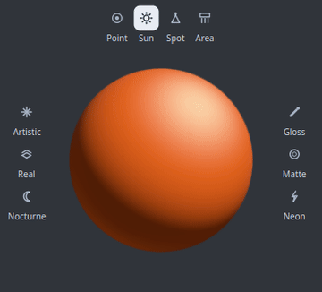
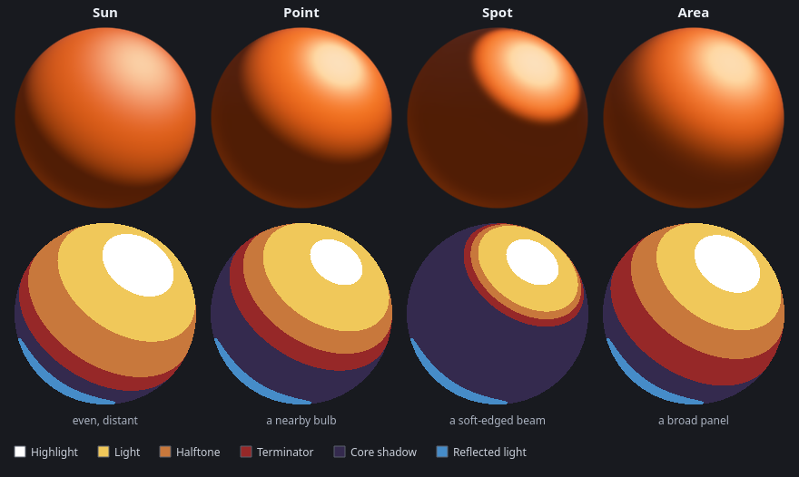
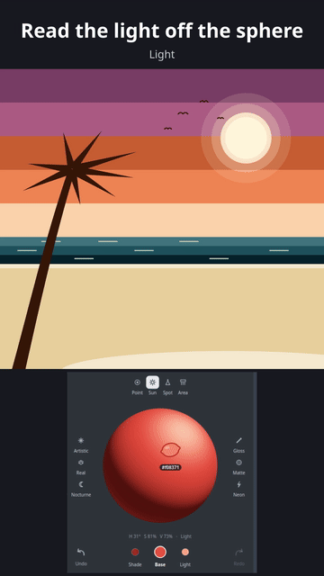

# Getting started with Lumina

Lumina shades a sphere from three colours you control — **shadow**, **base** and
**light** — so you can read how a key light, an ambient bounce and an object's
local colour interact. Then you sample the result straight into your brush.

The useful question it answers is never "what is the local colour" but "what
does this surface look like under this light" — which is why it works for flat
and cel-shaded illustration as much as for 3D shading and rendering. The three
targets and the shading controls are the same either way; the sphere just shows
you which look you are reading.


Flat graphic work on the canvas, a smoothly shaded 3D sphere in the panel, lit
from the same key. That is the point: the same three values read either way.


---

## 1. Install

**From a release:** download the `Lumina-*.zip` file, then in Krita go to
**Tools → Scripts → Import Python Plugin from File** and select the zip —
import it directly, no need to extract anything (manual extraction into the
plugins folder also works). Restart Krita afterwards.

**From source:** Lumina runs inside the Krita flatpak. From the repository root:

```bash
DEPLOY="$HOME/.var/app/org.kde.krita/data/krita/pykrita"
rsync -a --delete --exclude='__pycache__' --exclude='.pytest_cache' --exclude='lumina_log.txt' src/Lumina/ "$DEPLOY/Lumina/"
cp src/Lumina.desktop "$DEPLOY/"
```

Restart Krita afterwards — it caches its plugin list at startup, so closing the
window is not enough.

> Coming from a version that was called **LightingSphere**? Remove the old
> package once, or Krita will list the plugin twice. Your saved settings carry
> over automatically.
>
> ```bash
> rm -rf "$DEPLOY/LightingSphere" "$DEPLOY/LightingSphere.desktop"
> ```

[KritaFlatpak.md](KritaFlatpak.md) is the full deployment reference.

## 2. Enable the plugin

**Settings → Configure Krita → Python Plugin Manager**, tick **Lumina**, then
restart Krita.

## 3. Open the panel

**Settings → Dockers → Lumina** (on some builds: **View → Dock Widgets →
Lumina**).

The panel is a single narrow column, built to sit on the right edge. Top to
bottom:

| Row | What it is |
|---|---|
| Header | Gear (settings), the **Before** and **Now** color blocks, eyedropper — with copyable **hex values** under the blocks and an **EDIT SHADE / BASE / LIGHT** toggle for typing a new color into the selected target. |
| Lamp icons | **Point** (a nearby bulb) / **Sun** (even, distant light) / **Spot** (a soft-edged beam) / **Area** (a broad panel: soft edge, broad highlight) above the sphere. |
| The sphere | The shaded preview; it grows with the panel. The **lemon** rests on it under your pointer and shows the colour and hex under it, and the line under the sphere reads its **H / S / V** and the **form zone** (Highlight, Light, Halftone, Terminator, Core shadow, Reflected light). Click or drag to send that colour to Krita's brush. |
| Target dots + swatches | **Shade**, **Base** and **Light** selectors; the selected one's swatch grows with a white rim (and sparkles). The arrows at the ends **undo** and **redo** changes to the three colours. |
| Hue / Saturation / Value | Edits whichever target is active. |
| Contrast / Intensity | Light falloff and scene light level. |
| Recent picks | The last colours you picked on the sphere — click to paint with one again, double-click to make it the selected target's, right-click to pin or remove. |
| Presets | Six one-click looks, three per side of the sphere; click a lit one again to switch it off. |
| Advanced | The remaining lighting sliders and settings. |

Every slider shows its value at the right end — click the value to type a
number (`86` and `86%` both work on percent rows, `86`/`86°`/`86deg` on
angle rows; Enter commits, clicking away reverts). Clicking a slider's
track jumps the knob to the click; grabbing the knob drags relatively.

Under each color block sits its **hex value** — click to copy. The active box
shows the selected target, and its toggle — **EDIT SHADE**, **EDIT BASE** or
**EDIT LIGHT** — unlocks typing: type a new hex and press Enter. A base derives
its light and shadow (eyedropper-style); a shadow or highlight takes the color
as typed. The previous box stays display-only.

The **Use base color as brush** button lives in the gear **Settings** popup:
it sends the base colour to Krita's foreground. Slider edits never touch the
brush on their own.


## 4. Pick your three colours

Click a target's colour dot or its name to make it active, then move **Hue**,
**Saturation** and **Value**. The sphere re-renders live.

**Value** applies to the base target only — shadow and light are derived from it,
so the three stay a coherent set rather than three unrelated colours.

Here the base has been pushed to a cool blue, and the light and shadow followed
it:


## 5. Read the form, and change the lamp

Hover the sphere and the line under it names the **form zone** under the
lemon: *Highlight*, *Light*, *Halftone*, *Terminator*, *Core shadow* or
*Reflected light*, the bands a painter blocks in. The lamp icons above the
sphere change how the light falls, and the zones move with it:



- **Sun** — even, distant light; the widest bands.
- **Point** — a nearby bulb: hotter near the light, a smaller lit cap and more
  core shadow.
- **Spot** — a soft-edged beam: a lit pool, and everything outside it is
  shadow.
- **Area** — a broad panel: a wide, soft terminator and a broader, gentler
  highlight.



Then paint what you read: click a zone on the sphere to put its colour in your
brush, and lay that zone in on your own form, the light first, the core shadow
and reflected light after, the highlight last.



## 6. Try the presets

Six presets ship with the plugin: **Artistic**, **Real**, **Nocturne**,
**Gloss**, **Matte** and **Neon**. Each one fully defines the look, so
switching never leaves the previous preset's glow or ambient behind. Click the
lit preset again to switch it off: the lighting you had before comes back.

**Nocturne** applied — low key, cool moonlight, deep shadow:


| Nocturne | Gloss | Neon |
|---|---|---|
|  |  |  |
| Low key, cool moonlight, deep shadow | Tight bright highlight, slick and punchy | Bright core with a strong coloured bloom |

## 7. Sample from your own artwork

The **eyedropper** (the pipette glyph) activates Krita's own Color Sampler tool.
Click any pixel and Lumina builds a whole lighting set around it — not just the
base colour.

Here the sea teal has been sampled off the beach scene above (the line under
the sphere says where the new base came from):


| You sample | Base | Light | Shadow |
|---|---|---|---|
| `#ff8a4e` sunset | `#ff8a4e` | `#ffded4` | `#bb571e` |
| `#2c6b74` sea | `#2c6b74` | `#5aa584` | `#00354f` |
| `#efc994` sand | `#efc994` | `#ffffff` | `#bf8d41` |

The palette strip painted along the bottom of the beach scene came from an
earlier version of these derivations; the table is what Lumina gives today. The
same distribution runs automatically whenever the brush colour changes in Krita
— from the palette, a colour selector docker, or a script — with the base
selected; with the shade or highlight selected, only that target is replaced.

## 8. Sample the result into your brush

**Click and drag on the sphere.** Krita's foreground (brush) colour updates
immediately, so you can paint with the value you just read, and the colour lands
in **Recent picks**. The lemon pops on a click; hold the button long enough and
it starts to sweat. Arrow keys nudge it a pixel at a time for a precise pick
(Enter picks). **Use base color as brush** in the gear's Settings sends the base
colour across without a drag.

> The core rule of this tool: **the sphere's colours change only from the
> sliders, the hex box, or Krita's colour (the eyedropper, a selector). Clicking
> the sphere does not change the sphere** — it only chooses a colour to draw
> with. The one exception is deliberate: **Shift-click** makes the colour the
> selected target's.

## 9. Settings

The **gear** opens light direction, highlight size, render quality, **Sticky
distance** (how far past the sphere's edge a pick keeps hold), the sampler,
hex-value and **Compact panel** toggles, and **Save settings**. It opens beside
the panel, on the canvas side. Your setup is saved as you work and restored next time
Krita opens, so you never lose a lighting set to a crash or a forced quit.

## Where to next

- [MANUAL.md](../src/Lumina/MANUAL.md) — the full panel reference, also shown in
  Krita under **Help → Plugin Help**
- [ARCHITECTURE.md](ARCHITECTURE.md) — how the shading maths works
- [KritaFlatpak.md](KritaFlatpak.md) — deployment
- [Troubleshooting](CommonIssues.md) — if something does not look right
