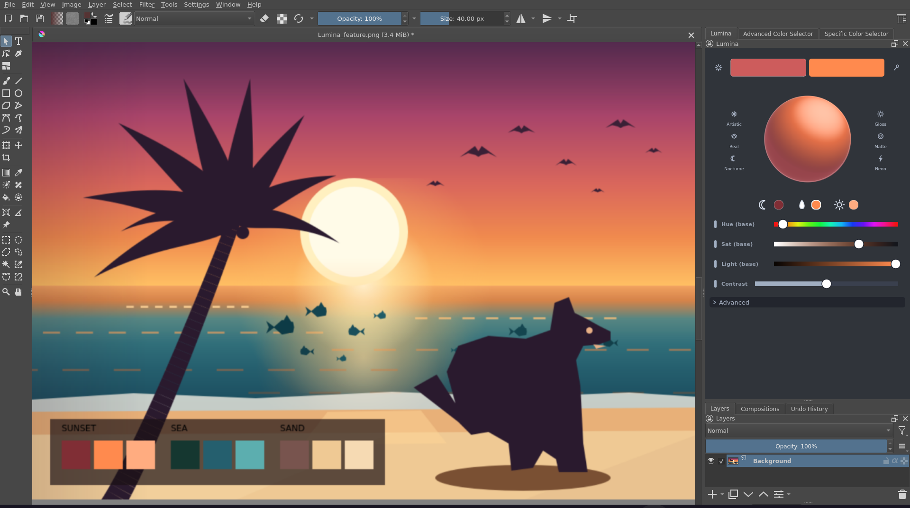
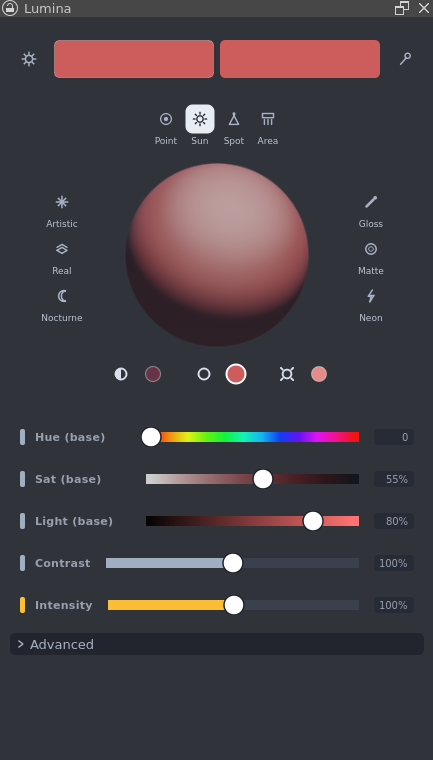
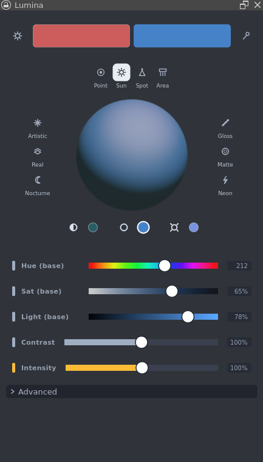
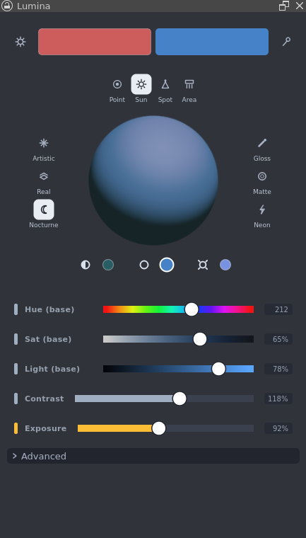
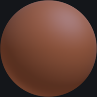
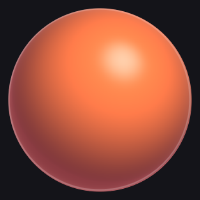
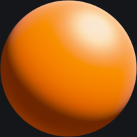
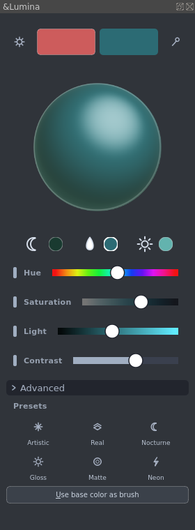

# Getting started with Lumina

Lumina shades a sphere from three colours you control — **shadow**, **base** and
**light** — so you can read how a key light, an ambient bounce and an object's
local colour interact. Then you sample the result straight into your brush.

The useful question it answers is never "what is the local colour" but "what
does this surface look like under this light" — which is why it works for flat
and cel-shaded illustration as much as for 3D shading and rendering. The three
targets and the shading controls are the same either way; the sphere just shows
you which look you are reading.



Flat graphic work on the left, a smoothly shaded 3D sphere on the right, lit
from the same key. That is the point: the same three values read either way.

---

## 1. Install

**From a release:** download the `Lumina-*.zip` file, then in Krita go to
**Tools → Scripts → Import Python Plugin from File** and select the zip —
import it directly, no need to extract anything (manual extraction into the
plugins folder also works). Restart Krita afterwards.

**From source:** Lumina runs inside the Krita flatpak. From the repository root:

```bash
DEPLOY="$HOME/.var/app/org.kde.krita/data/krita/pykrita"
rsync -a --delete --exclude='__pycache__' src/Lumina/ "$DEPLOY/Lumina/"
cp src/Lumina.desktop "$DEPLOY/"
```

Restart Krita afterwards — it caches its plugin list at startup, so closing the
window is not enough.

> Coming from a version that was called **LightingSphere**? Remove the old
> package once, or Krita will list the plugin twice. Your saved settings carry
> over automatically.
>
> ```bash
> rm -rf "$DEPLOY/LightingSphere" "$DEPLOY/LightingSphere.desktop"
> ```

[KritaFlatpak.md](KritaFlatpak.md) is the full deployment reference.

## 2. Enable the plugin

**Settings → Configure Krita → Python Plugin Manager**, tick **Lumina**, then
restart Krita.

## 3. Open the panel

**Settings → Dockers → Lumina** (on some builds: **View → Dock Widgets →
Lumina**).

The panel is a single narrow column, built to sit on the right edge. Top to
bottom:

| Row | What it is |
|---|---|
| Header | Gear (settings), the **original** and **active** color blocks, eyedropper — with copyable **hex values** under the blocks and an **EDIT** toggle for typing new ones. |
| Lamp icons | **Point** / **Sun** / **Spot** / **Area** above the sphere. |
| The sphere | The shaded preview. Drag across it to sample a colour. |
| Target dots + swatches | **Shadow**, **Base** and **Light** selectors; the active target's swatch grows with a white rim. |
| Hue / Saturation / Light | Edits whichever target is active. |
| Contrast / Intensity | Light falloff and scene light level. |
| Presets | Six one-click looks, three per side of the sphere. |
| Advanced | The remaining lighting sliders and settings. |

Every slider shows its value at the right end — click the value to type a
number (`86` and `86%` both work on percent rows, `86`/`86°`/`86deg` on
angle rows; Enter commits, clicking away reverts). Clicking a slider's
track jumps the knob to the click; grabbing the knob drags relatively.

Under each color block sits its **hex value** — click to copy. The **EDIT**
toggle next to the active hash unlocks typing: type a new hex into the
active box and press Enter, and the full lighting set is derived from it
(eyedropper-style). The previous box stays display-only.

The **Use base color as brush** button lives in the gear **Settings** popup:
it sends the base colour to Krita's foreground. Slider edits never touch the
brush on their own.



## 4. Pick your three colours

Click a target glyph or its swatch to make it active, then move **Hue**,
**Saturation** and **Light**. The sphere re-renders live.

`Light` applies to the base target only — shadow and light are derived from it,
so the three stay a coherent set rather than three unrelated colours.

Here the base has been pushed to a cool blue, and the light and shadow followed
it:



## 5. Try the presets

Six presets ship with the plugin: **Artistic**, **Real**, **Nocturne**,
**Gloss**, **Matte** and **Neon**. Each one fully defines the look, so
switching never leaves the previous preset's glow or ambient behind.

**Nocturne** applied — low key, cool moonlight, deep shadow:



| Nocturne | Gloss | Neon |
|---|---|---|
|  |  |  |
| Low key, cool moonlight, deep shadow | Tight bright highlight, slick and punchy | Bright core with a strong coloured bloom |

## 6. Sample from your own artwork

The **eyedropper** (the pipette glyph) activates Krita's own Color Sampler tool.
Click any pixel and Lumina builds a whole lighting set around it — not just the
base colour.

Here the sea teal has been sampled off the beach scene above:



| You sample | Base | Light | Shadow |
|---|---|---|---|
| `#ff8a4e` sunset | `#ff8a4e` | `#ffac80` | `#802e35` |
| `#2c6b74` sea | `#2c6b74` | `#63b3ae` | `#193a30` |
| `#efc994` sand | `#efc994` | `#f6dab3` | `#78544e` |

Sample three colours off the sunset beach in the first screenshot and you get
exactly the palette strip painted along the bottom of it. That distribution also
runs automatically whenever the brush colour changes externally — from the
palette, the colour selector docker, or a script.

## 7. Sample the result into your brush

**Click and drag on the sphere.** Krita's foreground (brush) colour updates
immediately, so you can paint with the value you just read. The button at the
bottom of the panel sends the base colour across without a drag.

> The core rule of this tool: **the sphere's colours change only from the
> sliders, the target dots, or the eyedropper. Clicking the sphere does not
> change the sphere** — it only chooses a colour to draw with.

## 8. Settings

The **gear** opens light direction, render quality, the sampler and hex-value
toggles, and **Save settings**. Your setup is saved as you work and restored next time
Krita opens, so you never lose a lighting set to a crash or a forced quit.

## Where to next

- [MANUAL.md](../src/Lumina/MANUAL.md) — the full panel reference, also shown in
  Krita under **Help → Plugin Help**
- [ARCHITECTURE.md](ARCHITECTURE.md) — how the shading maths works
- [KritaFlatpak.md](KritaFlatpak.md) — deployment
- [Troubleshooting](CommonIssues.md) — if something does not look right
